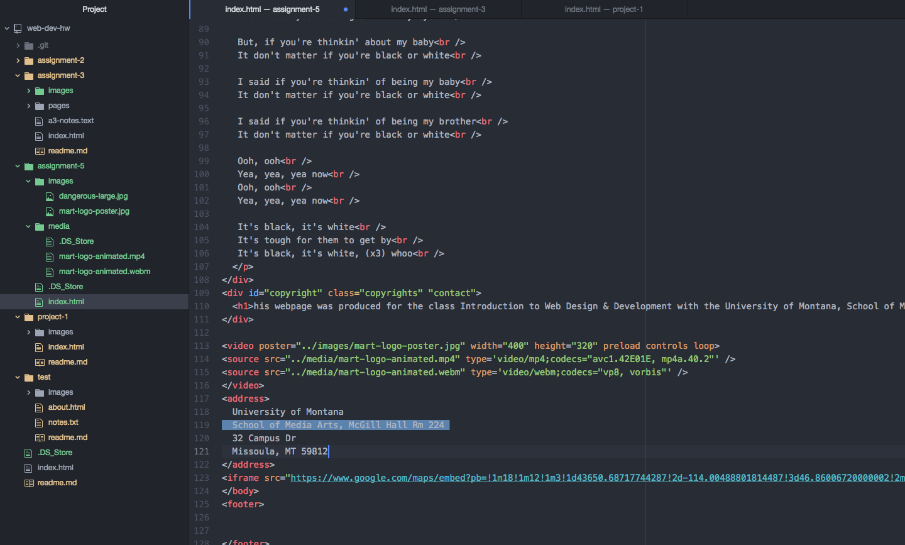

# Assignment 5

The div element is used to section off groups of information into chunks. While spans are used to group even more specific information into individual chunks inside of the div element. ID's are unique identifiers and are used to distinguish a unique element. ID's should only be used for 1 element. While classes can be associated with many elements and are meant to group similar elements. An element can also have many classes.

You would consider third party media for a multitude of reasons, but the main reason would be the potential cost associated with self-hosted media opposed to free third party media. Another reason is the code is already written out for you in third-party media sources which makes it easy to input into code.

My work cycle for this assignment was similar to my past assignments. I found this assignment easier than the last. I began by going through the material on the course website and took good notes so I wouldn't have to constantly go back and forth which saved some time. Once I worked through the assignment I had to go back and edit multiple times to get everything right. Overall I learned a lot of new code which will be useful in other classes

 
